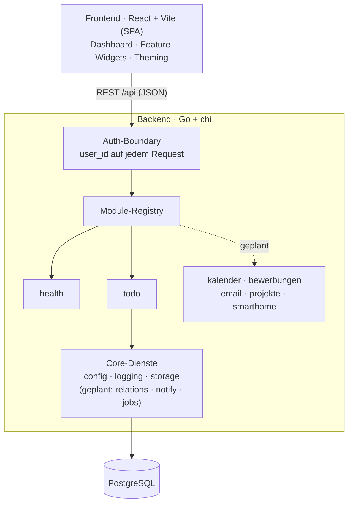

# pad — Personal Assistant Dashboard

Ein persönliches Dashboard, das die Dinge bündelt, die sonst über fünf Apps verteilt sind:
ToDos, Kalender, Bewerbungen, E-Mail, Projekt-Übersicht und Smart Home — sauber getrennt,
an einem Ort. Erst lokal, später im Heimnetz oder gehostet.

## Ziel

Ich verzettele mich über zu viele Tools. pad soll mein eigener Assistent sein: ein Ort, der
zeigt was ansteht, ohne dass ich zwischen Kalender, Mail und drei ToDo-Listen springe. Bewusst
**modular** gebaut — jedes Thema ist ein eigenes Modul, das sich ein- oder ausschalten lässt,
ohne den Rest anzufassen.

Nebenbei ist es ein Lern- und Portfolio-Projekt: moderne Sprachen kombinieren (Go, TypeScript,
später Python), von Anfang an testen, und Schritt für Schritt Richtung Hosting wachsen.

## Architektur

Frontend und Backend sind strikt getrennt. Das Backend ist ein Monolith aus **austauschbaren
Modulen**: jedes Modul meldet seine Routen bei einer zentralen Registry an, alle hängen hinter
einer gemeinsamen Auth-Boundary, und die Schnittstelle ist das Wichtige — ein Modul wegzulassen
oder zu ersetzen bricht nichts anderes.

Mehr im Detail: [ARCHITECTURE.md](ARCHITECTURE.md) (Aufbau & Schnittstellen) und
[DESIGN.md](DESIGN.md) (Theming & UI).

## Tech-Stack

- **Frontend:** React + Vite + TypeScript (SPA), SCSS-Tokens fürs Theming (hell/dunkel, Standard- & Google-Preset)
- **Backend:** Go mit chi, sqlc für typsichere Queries, strukturiertes Logging via slog
- **Datenbank:** PostgreSQL (pgx-Treiber, goose-Migrationen)
- **Tests/CI:** Go-Tests + Vitest, GitHub Actions gated jeden PR
- **Später:** Python-Worker (Log-Analyse, Job-Scraper), Docker, Google-OAuth

## Lokal starten

Voraussetzungen: Go 1.26, Node 22, PostgreSQL.

1. Rolle `pad` und die Datenbanken `pad` + `pad_test` anlegen.
2. `backend/.env` aus `backend/.env.example` erstellen und `DATABASE_URL` setzen.
3. Backend: `go -C backend run ./cmd/pad` — läuft auf `:8080`, migriert beim Start.
4. Frontend: `npm --prefix frontend run dev` — Vite proxyt `/api` aufs Backend.

## Stand

### Done
- **Foundation:** Monorepo, Go+chi-Backend und React+Vite-Frontend, durchgestochen lauffähig
- **Auth-Boundary** mit „no-auth"-Dev-Modus (lautes Banner + Bind-Guard, siehe [SECURITY.md](SECURITY.md))
- **Theming:** hell (Excel) / dunkel (Notion) + Google-Preset, zur Laufzeit umschaltbar
- **Logging:** strukturiert via slog, `text`/`json` über `PAD_LOG_FORMAT`, plus Request-Logging
- **CI** (GitHub Actions) + Tests fürs Core und gegen echtes Postgres

### WIP / ToDo
- **ToDo-Modul** (aktueller Branch): Postgres-Datenlayer ✓, Projekte-CRUD ✓, Todos-CRUD ✓ — Tags und das Frontend sind in Arbeit
- **Wiederholungen** (recurring ToDos) als eigene Slice danach
- **Docker-Slice** — Postgres + Backend containerisieren
- **Weitere Module:** Kalender, Bewerbungen, E-Mail, Projekt-Übersicht, Smart Home
- **Google-OAuth** (Login + Kalender/Mail-Zugriff) — Pflicht, bevor pad ins Netz geht

---

> Die Bereiche **Done** und **WIP / ToDo** werden vor jedem PR aktualisiert.
