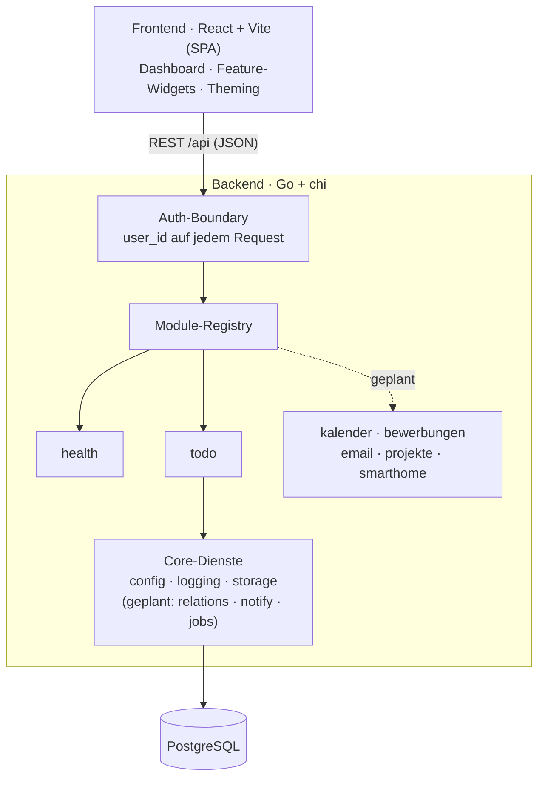

# pad — Personal Assistant Dashboard

Ein persönliches Dashboard, das die Dinge bündelt, die sonst über fünf Apps verteilt sind:
ToDos, Kalender, Bewerbungen, E-Mail, Projekt-Übersicht und Smart Home — sauber getrennt,
an einem Ort. Erst lokal, später im Heimnetz oder gehostet.

## Ziel

Ich verzettele mich über zu viele Tools. pad soll mein eigener Assistent sein: ein Ort, der
zeigt was ansteht, ohne dass ich zwischen Kalender, Mail und drei ToDo-Listen springe. Bewusst
**modular** gebaut — jedes Thema ist ein eigenes Modul, das sich ein- oder ausschalten lässt,
ohne den Rest anzufassen.

Nebenbei ist es ein Lern- und Portfolio-Projekt: moderne Sprachen kombinieren (Go, TypeScript,
später Python), von Anfang an testen, und Schritt für Schritt Richtung Hosting wachsen.

## Architektur

Frontend und Backend sind strikt getrennt. Das Backend ist ein Monolith aus **austauschbaren
Modulen**: jedes Modul meldet seine Routen bei einer zentralen Registry an, alle hängen hinter
einer gemeinsamen Auth-Boundary, und die Schnittstelle ist das Wichtige — ein Modul wegzulassen
oder zu ersetzen bricht nichts anderes.

Mehr im Detail: [ARCHITECTURE.md](ARCHITECTURE.md) (Aufbau & Schnittstellen) und
[DESIGN.md](DESIGN.md) (Theming & UI).

## Tech-Stack

- **Frontend:** React + Vite + TypeScript (SPA); **Tailwind CSS + shadcn/ui** (Radix) für Komponenten, **lucide-react** für Icons — auf die bestehenden **SCSS-Tokens** gemappt, sodass das Theming (hell/dunkel, Standard- & Google-Preset) *eine* Quelle bleibt
- **Backend:** Go mit chi, sqlc für typsichere Queries, strukturiertes Logging via slog
- **Datenbank:** PostgreSQL (pgx-Treiber, goose-Migrationen)
- **Tests/CI:** Go-Tests + Vitest, GitHub Actions gated jeden PR
- **Später:** Python-Worker (Log-Analyse, Job-Scraper), Docker, Google-OAuth

## Lokal starten

Zwei Wege: alles nativ (unten), oder PostgreSQL **und** Backend per Docker
([Abschnitt unten](#mit-docker-postgres--backend)).

Voraussetzungen (nativ): Go 1.26, Node 22, PostgreSQL. **Postgres muss laufen** —
`npm run dev` startet keine Datenbank (dafür gibt es den Docker-Weg).

1. Rolle `pad` und die Datenbanken `pad` + `pad_test` anlegen.
2. `backend/.env` aus `backend/.env.example` erstellen und `DATABASE_URL` setzen.
3. Einmalig Abhängigkeiten holen: `npm install` (Repo-Root, für den Dev-Orchestrator) und `npm --prefix frontend install`.
4. `npm run dev` — startet Backend (`:8080`, migriert beim Start) **und** Frontend (Vite, proxyt `/api`) zusammen. Strg-C stoppt beide.

### Befehle (Repo-Root)

| Befehl | Tut |
|---|---|
| `npm run dev` | Backend + Frontend parallel starten (`-k`, Strg-C beendet beide) |
| `npm run check` | Schneller Wiring-Check **ohne DB**: Frontend-Build + `go build`/`go vet` |
| `npm test` | Frontend-Tests + Go-Tests (die Go-Integrationstests brauchen ein laufendes `pad_test`) |
| `npm run verify` | `check` + `test` zusammen |

Ein späterer Dienst wird als `dev:<name>`-Script ergänzt und an die `dev`-Zeile gehängt.

> **Windows-PATH:** `npm run *:backend` ruft `go` über cmd/PowerShell auf. Fehlt
> `C:\Program Files\Go\bin` im **System-PATH**, erscheint „der Befehl 'go' … konnte nicht
> gefunden werden" — dann diesen Pfad zur PATH-Umgebungsvariable hinzufügen (ein gesetzter
> Git-Bash-PATH genügt nicht, npm nutzt cmd).

### Mit Docker (Postgres + Backend)

Braucht nur **Docker Desktop** — kein lokales Go/Postgres-Setup.

1. `npm run docker:up` (bzw. `docker compose up --build`) — baut das Backend-Image,
   startet PostgreSQL (mit Volume) und das Backend; Migrationen laufen beim Start.
2. Backend liegt auf `http://127.0.0.1:8080`, Postgres auf `127.0.0.1:5432`.
3. Frontend weiterhin auf dem Host: `npm --prefix frontend run dev` (Vite proxyt
   `/api` aufs Backend). `npm run docker:down` stoppt den Stack.

| Befehl | Tut |
|---|---|
| `npm run docker:up` | Postgres + Backend bauen und starten |
| `npm run docker:down` | Stack stoppen (Daten bleiben im Volume) |
| `npm run docker:logs` | Logs beider Container folgen |

> **Sicherheit:** Beide Ports sind nur auf den **Host-Loopback** (`127.0.0.1`)
> veröffentlicht, also nicht aus dem Netz erreichbar — deshalb ist `AUTH_MODE=none`
> hier vertretbar. Der Container-Bind auf `0.0.0.0` ist über den expliziten Schalter
> `PAD_ALLOW_NONLOOPBACK_BIND=1` erlaubt; **nie** mit netz-erreichbarer Veröffentlichung
> kombinieren (siehe [SECURITY.md](SECURITY.md)). Netz-Exposition erst mit echtem Auth.

## Stand

### Done
- **Foundation:** Monorepo, Go+chi-Backend und React+Vite-Frontend, durchgestochen lauffähig
- **Auth-Boundary** mit „no-auth"-Dev-Modus (lautes Banner + Bind-Guard, siehe [SECURITY.md](SECURITY.md))
- **Theming:** hell (Excel) / dunkel (Notion) + Google-Preset, zur Laufzeit umschaltbar
- **Logging:** strukturiert via slog, `text`/`json` über `PAD_LOG_FORMAT`, plus Request-Logging
- **CI** (GitHub Actions) + Tests fürs Core und gegen echtes Postgres, Frontend via Vitest + Testing Library + MSW; dazu Lint (oxlint), Format-Check (gofmt) und ein Lizenz-Gate (`npm run license-check`: failt bei GPL/AGPL/LGPL in ausgelieferten Deps) als Gates
- **Dev-Orchestrator:** `npm run dev` startet Backend + Frontend mit einem Befehl (Root-`package.json` + `concurrently`); dazu `check` / `test` / `verify`
- **Docker:** `docker compose up` startet PostgreSQL + Backend (Multi-Stage-Image, non-root, Healthchecks, persistentes Volume); Ports nur auf Host-Loopback veröffentlicht. CI baut das Image und smoke-testet `/api/health`, damit das Rezept nicht unbemerkt verrottet
- **ToDo-Modul (Backend):** Projekte, Todos und Tags — CRUD, Verknüpfungen, **flexible Sortierung** (Priorität/Aufwand/Deadline) + Aufwandsschätzung, voll getestet
- **ToDo-Modul (Frontend):** token-basiertes Dashboard — Sidebar, to-dos-Liste, Sortierung (priority/effort/deadline), Listen-Dichte (komfortabel/kompakt), Abhaken und Inline-Anlegen; hell/dunkel; Komponententests im CI gegated
- **Custom-Reihenfolge:** Aufgaben aus **jeder** Sortierung per Drag-and-drop umordnen — die Anordnung wird automatisch als „custom"-Reihenfolge gespeichert und angezeigt; persistent über `todos.position` + Reorder-Endpoint (Transaktion, ownership-geprüft), neue Todos hängen hinten an
- **settings:** eigener Bereich fürs Erscheinungsbild — Preset (Standard/Google), hell/dunkel und Standard-Listendichte; geräteweit in localStorage gespeichert. Preset aus der Topbar hierher verschoben, hell/dunkel-Toggle bleibt oben
- **Aufgaben-Parameter inline setzen** — project, due, priority, effort direkt an der Aufgabe über kleine Chips mit Klick-Menü (gleich beim Anlegen und beim Bearbeiten, optimistisch). Sticky Create-Zeile oben in Task-Optik; „c" öffnet sie, Enter legt an + kurzer Highlight an der sortierten Stelle
- **Fertige Todos & Filter:** Abhaken lässt die Aufgabe ~3 s stehen (erneuter Klick = rückgängig), dann blendet sie sanft aus und die Liste rückt nach; ausklappbares Filter-Panel (offen/fertig/beides + Projekt), Wahl geräteweit gespeichert, fertige sinken bei „beides" nach unten
- **Triage-Command-Layout (to-dos):** Focus-Band mit Live-Indikatoren (überfällig / heute fällig / geschätzte Zeit heute), Liste nach Datums-Buckets gruppiert (`overdue → today → this week → later → no date → done`, die Sortierung ordnet innerhalb), und eine Kontext-Rail (`week ahead` + `by project` + `tags`, Klick filtert die Liste) — macht Triage zum sichtbaren Aufbau und füllt breite Schirme; responsiv (Rail < 1080px, Sidebar < 760px weg). Unit- + Komponententests
- **Shell-Grundaufbau:** globale Nav und Modul-Kontext getrennt — eine **voll ein-/ausklappbare Nav-Sidebar** zeigt nur die Module; standardmäßig komplett eingeklappt (voller Platz für Inhalt), Aufklappen per Klick auf den Panel-Toggle in der Kopfleiste (persistiert, `Escape` schließt). Aufgeklappt ist sie eine **schwebende Card auf höherer Ebene** (12px Abstand zu den Fensterkanten, gerundet, Schatten), die den Inhalt **verschiebt** statt zu verdecken — wie in der Claude-Desktop-App. Projekte/Tags sind aus der globalen Leiste in die to-dos-Kontext-Rail gewandert. **Zentrierte Topbar-Suche** mit `⌘K`/`Ctrl K`-Shortcut. Komponententests fürs Auf-/Zuklappen + Shortcut
- **Tailwind + shadcn/ui-Fundament:** Tailwind CSS (v3) + shadcn/ui (Radix) + lucide-react ins Frontend adoptiert — **ohne UI/UX-Bruch**: Tailwind-Utilities zeigen auf die bestehenden `--color-*`/`--radius-*`-Tokens (eine Quelle, Preset×Mode bleibt), Preflight aus (kein Reset der Altkomponenten), `@`-Alias + `cn`-Util + `components.json` eingerichtet. Proof-of-Concept: Shell-Icons auf lucide umgestellt (Stroke/Größe gematcht) und die Topbar-Buttons auf die shadcn-`Button`-Komponente
- **Dashboard-Startseite (erste Ausbaustufe):** statt Platzhalter ein ruhiges „heute"-Zuhause — zeitbasierter Gruß, dieselben Live-Indikatoren wie das to-dos-Band, und ein Panel-Raster, das die Modul-Bausteine wiederverwendet: `today & overdue` (Fokusliste mit Sprung in die to-dos), `week ahead`, `by project` (Klick öffnet die gefilterte Liste) plus dezente „coming soon"-Kacheln für Kalender/Bewerbungen. Konfigurierbare Widgets ersetzen das später
- **Tags pro Aufgabe:** Tags an Aufgaben setzen/entfernen über ein Multi-Select-Chip-Feld (inkl. „neuen Tag anlegen") direkt in der Liste; die Todo-Liste bettet die Tags backend-seitig in *einer* Antwort ein (Aggregat-Query statt N+1), Anzeige als Chip an der Zeile, plus **Tag-Filter** im Panel. Voll getestet (Go-Integrationstest fürs Embedding, MSW-Komponententests fürs Zuweisen + Filtern). Lucide-Icon-Migration abgeschlossen
- **Listen-Controls auf shadcn/Radix:** die 5 Param-Menüs (project/due/priority/effort/tags) vom handgebauten Popover auf Radix/shadcn-`Popover` portiert (Anker, Portal, Outside-Click, Escape und Fokus-Rückgabe macht jetzt Radix; Token-Optik und Verhalten unverändert, eigener Popover-Code gelöscht), plus jsdom-Polyfills für die Radix-Primitives in den Tests. Die Sortierung wanderte von der Pill-Reihe in **ein kompaktes Dropdown** (shadcn-`DropdownMenu`: aktueller Key im Trigger, Häkchen + Richtungs-Hinweis je Option) — skaliert auf mehr Kriterien, ohne die Controlbar zu verbreitern
- **Filter-Redesign (Toolbar statt Panel):** das ausklappbare Filter-Panel mit Pill-Reihen ist ersetzt durch das Muster moderner Tools (Linear/GitHub): **ein `filter`-Dropdown** in der Control-Zeile (Sektionen show/projekt/tag, Häkchen am aktiven Eintrag; Auswahl schließt das Menü nicht, mehrere Filter gehen in einem Besuch) und **aktive Filter als entfernbare Tokens** daneben (`done ×`, `● projekt ×`, `#tag ×`). Ruhezustand = eine leere Zeile, nichts schiebt die Liste herunter; Filter + Sortierung leben jetzt in einer Leiste. Tests umgestellt (Menü-Flow + Token-Entfernen)
- **Tags im Create-Tile:** Tags lassen sich jetzt schon beim Anlegen setzen — fünfter Chip im Create-Tile mit demselben Multi-Select-Menü wie an bestehenden Zeilen (inkl. „neuen Tag anlegen"); die Auswahl lebt client-seitig im Entwurf und wird nach dem Anlegen über den bestehenden Attach-Endpoint an die neue Aufgabe gehängt (reine Wiederverwendung: `TagsField` + vorhandene Hooks, kein Backend-Umbau). Komponententests für beide Wege (Tag wählen / inline anlegen)

- **Sortierung kombinieren (sort by + then by):** das Sort-Menü hat jetzt zwei Sektionen — Primärkriterium plus optionales „then by" als Tiebreaker (z. B. Deadline, bei Gleichstand höchste Priorität zuerst; Backend-`?sort=a,b`). Auswahl hält das Menü offen (beide Kriterien in einem Besuch), Trigger zeigt `deadline · priority`; „custom" ist als manuelle Total-Ordnung vom Tiebreaker ausgenommen

- **UX-Härtung (nach Design-Critique):** stille Fehler sichtbar gemacht — ein **Toast** meldet jede fehlgeschlagene Mutation (globaler React-Query-`MutationCache`-onError), während der optimistische Stand zurückrollt; **Aufgaben löschen** über ein Zeilen-Menü (Kebab → „delete" mit Zwei-Klick-Bestätigung, optimistisch); **Placeholder-Kontrast** auf AA gebracht (explizites Token statt gedimmtem Browser-Default; ~5–6.7:1 in beiden Modi); tote Controls ehrlich gemacht (Suche + Glocke als deaktiviertes „coming soon" statt Buttons, die Funktion vortäuschen); Param-Chips auf Touch immer sichtbar (`@media (hover: none)`); Fehlertext ohne Dev-Jargon. Voll getestet (Löschen-Flow, Fehler-Toast + Rollback)
- **Markdown-Export („share"):** der share-Button ist jetzt echt — ein Popover exportiert **genau die sichtbare Liste** (Filter, Sortierung und Datums-Gruppierung wie auf dem Schirm) als GitHub-flavoured Markdown: H2 je Bucket, `- [ ]`/`- [x]`-Checkboxen, Feldauswahl (Projekt/Deadline/Priorität/Aufwand/Tags, geräteweit gespeichert). Zwei Wege: in die Zwischenablage kopieren (mit sichtbarem Erfolg **und** Fehlschlag am Button) oder als datierte `.md`-Datei laden. Reine Frontend-Slice (`exportMd.ts` pur + unit-getestet, MSW-Komponententest für den Copy-Flow)

### WIP / ToDo
- **Listen-Gruppierung ausbauen** — die Zeitraum-Gruppierung (Datums-Buckets) steht; offen bleiben Gruppierung **pro Projekt** und frei wählbare/anpassbare Gruppierungs-Achsen. Geplant.
- **Konfigurierbares Dashboard** als Startseite (Widgets: was wird wo angezeigt). Geplant.
- **Daten/Analytics** — modulübergreifende Infos, evtl. eigenes Analytics-Modul. Offen.
- **Wiederholungen** (recurring ToDos) als eigene Slice danach
- **Docker-Folgeschritte** — Frontend-Container / Tauri-Verpackung
- **Weitere Module:** Kalender, Bewerbungen, E-Mail, Projekt-Übersicht, Smart Home
- **Google-OAuth** (Login + Kalender/Mail-Zugriff) — Pflicht, bevor pad ins Netz geht

## Lizenz

pad ist **proprietär** — © 2026 Tim Schwietzke, alle Rechte vorbehalten. Der Quellcode
ist öffentlich nur zur **Ansicht/Bewertung** (Portfolio), **nicht** als Open Source; keine
Nutzungs-, Kopier- oder Weiterverbreitungsrechte ohne ausdrückliche Erlaubnis. Siehe [LICENSE](LICENSE).

---

> Die Bereiche **Done** und **WIP / ToDo** werden vor jedem PR aktualisiert.
