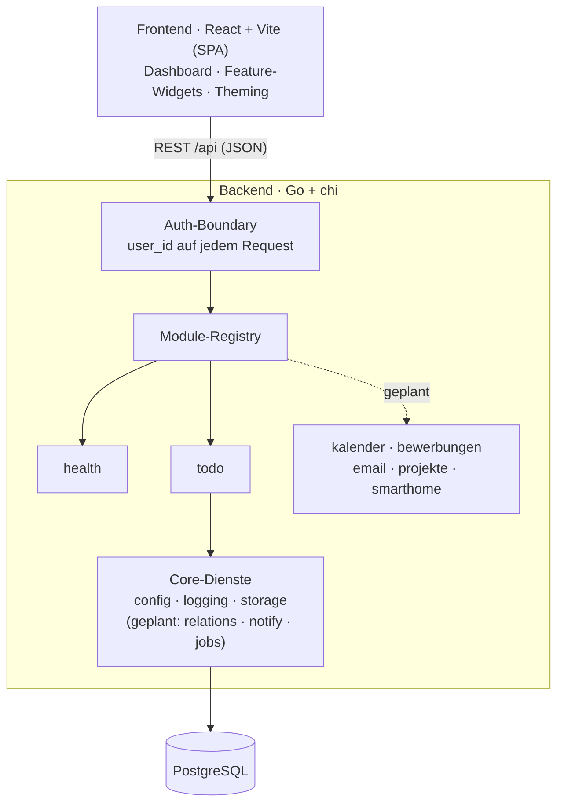

# pad — Personal Assistant Dashboard

Ein persönliches Dashboard, das die Dinge bündelt, die sonst über fünf Apps verteilt sind:
ToDos, Kalender, Bewerbungen, E-Mail, Projekt-Übersicht und Smart Home — sauber getrennt,
an einem Ort. Erst lokal, später im Heimnetz oder gehostet.

## Ziel

Ich verzettele mich über zu viele Tools. pad soll mein eigener Assistent sein: ein Ort, der
zeigt was ansteht, ohne dass ich zwischen Kalender, Mail und drei ToDo-Listen springe. Bewusst
**modular** gebaut — jedes Thema ist ein eigenes Modul, das sich ein- oder ausschalten lässt,
ohne den Rest anzufassen.

Nebenbei ist es ein Lern- und Portfolio-Projekt: moderne Sprachen kombinieren (Go, TypeScript,
später Python), von Anfang an testen, und Schritt für Schritt Richtung Hosting wachsen.

## Architektur

Frontend und Backend sind strikt getrennt. Das Backend ist ein Monolith aus **austauschbaren
Modulen**: jedes Modul meldet seine Routen bei einer zentralen Registry an, alle hängen hinter
einer gemeinsamen Auth-Boundary, und die Schnittstelle ist das Wichtige — ein Modul wegzulassen
oder zu ersetzen bricht nichts anderes.

Mehr im Detail: [ARCHITECTURE.md](ARCHITECTURE.md) (Aufbau & Schnittstellen) und
[DESIGN.md](DESIGN.md) (Theming & UI).

## Tech-Stack

- **Frontend:** React + Vite + TypeScript (SPA), SCSS-Tokens fürs Theming (hell/dunkel, Standard- & Google-Preset)
- **Backend:** Go mit chi, sqlc für typsichere Queries, strukturiertes Logging via slog
- **Datenbank:** PostgreSQL (pgx-Treiber, goose-Migrationen)
- **Tests/CI:** Go-Tests + Vitest, GitHub Actions gated jeden PR
- **Später:** Python-Worker (Log-Analyse, Job-Scraper), Docker, Google-OAuth

## Lokal starten

Zwei Wege: alles nativ (unten), oder PostgreSQL **und** Backend per Docker
([Abschnitt unten](#mit-docker-postgres--backend)).

Voraussetzungen (nativ): Go 1.26, Node 22, PostgreSQL. **Postgres muss laufen** —
`npm run dev` startet keine Datenbank (dafür gibt es den Docker-Weg).

1. Rolle `pad` und die Datenbanken `pad` + `pad_test` anlegen.
2. `backend/.env` aus `backend/.env.example` erstellen und `DATABASE_URL` setzen.
3. Einmalig Abhängigkeiten holen: `npm install` (Repo-Root, für den Dev-Orchestrator) und `npm --prefix frontend install`.
4. `npm run dev` — startet Backend (`:8080`, migriert beim Start) **und** Frontend (Vite, proxyt `/api`) zusammen. Strg-C stoppt beide.

### Befehle (Repo-Root)

| Befehl | Tut |
|---|---|
| `npm run dev` | Backend + Frontend parallel starten (`-k`, Strg-C beendet beide) |
| `npm run check` | Schneller Wiring-Check **ohne DB**: Frontend-Build + `go build`/`go vet` |
| `npm test` | Frontend-Tests + Go-Tests (die Go-Integrationstests brauchen ein laufendes `pad_test`) |
| `npm run verify` | `check` + `test` zusammen |

Ein späterer Dienst wird als `dev:<name>`-Script ergänzt und an die `dev`-Zeile gehängt.

> **Windows-PATH:** `npm run *:backend` ruft `go` über cmd/PowerShell auf. Fehlt
> `C:\Program Files\Go\bin` im **System-PATH**, erscheint „der Befehl 'go' … konnte nicht
> gefunden werden" — dann diesen Pfad zur PATH-Umgebungsvariable hinzufügen (ein gesetzter
> Git-Bash-PATH genügt nicht, npm nutzt cmd).

### Mit Docker (Postgres + Backend)

Braucht nur **Docker Desktop** — kein lokales Go/Postgres-Setup.

1. `npm run docker:up` (bzw. `docker compose up --build`) — baut das Backend-Image,
   startet PostgreSQL (mit Volume) und das Backend; Migrationen laufen beim Start.
2. Backend liegt auf `http://127.0.0.1:8080`, Postgres auf `127.0.0.1:5432`.
3. Frontend weiterhin auf dem Host: `npm --prefix frontend run dev` (Vite proxyt
   `/api` aufs Backend). `npm run docker:down` stoppt den Stack.

| Befehl | Tut |
|---|---|
| `npm run docker:up` | Postgres + Backend bauen und starten |
| `npm run docker:down` | Stack stoppen (Daten bleiben im Volume) |
| `npm run docker:logs` | Logs beider Container folgen |

> **Sicherheit:** Beide Ports sind nur auf den **Host-Loopback** (`127.0.0.1`)
> veröffentlicht, also nicht aus dem Netz erreichbar — deshalb ist `AUTH_MODE=none`
> hier vertretbar. Der Container-Bind auf `0.0.0.0` ist über den expliziten Schalter
> `PAD_ALLOW_NONLOOPBACK_BIND=1` erlaubt; **nie** mit netz-erreichbarer Veröffentlichung
> kombinieren (siehe [SECURITY.md](SECURITY.md)). Netz-Exposition erst mit echtem Auth.

## Stand

### Done
- **Foundation:** Monorepo, Go+chi-Backend und React+Vite-Frontend, durchgestochen lauffähig
- **Auth-Boundary** mit „no-auth"-Dev-Modus (lautes Banner + Bind-Guard, siehe [SECURITY.md](SECURITY.md))
- **Theming:** hell (Excel) / dunkel (Notion) + Google-Preset, zur Laufzeit umschaltbar
- **Logging:** strukturiert via slog, `text`/`json` über `PAD_LOG_FORMAT`, plus Request-Logging
- **CI** (GitHub Actions) + Tests fürs Core und gegen echtes Postgres, Frontend via Vitest + Testing Library + MSW; dazu Lint (oxlint), Format-Check (gofmt) und ein Lizenz-Gate (`npm run license-check`: failt bei GPL/AGPL/LGPL in ausgelieferten Deps) als Gates
- **Dev-Orchestrator:** `npm run dev` startet Backend + Frontend mit einem Befehl (Root-`package.json` + `concurrently`); dazu `check` / `test` / `verify`
- **Docker:** `docker compose up` startet PostgreSQL + Backend (Multi-Stage-Image, non-root, Healthchecks, persistentes Volume); Ports nur auf Host-Loopback veröffentlicht. CI baut das Image und smoke-testet `/api/health`, damit das Rezept nicht unbemerkt verrottet
- **ToDo-Modul (Backend):** Projekte, Todos und Tags — CRUD, Verknüpfungen, **flexible Sortierung** (Priorität/Aufwand/Deadline) + Aufwandsschätzung, voll getestet
- **ToDo-Modul (Frontend):** token-basiertes Dashboard — Sidebar, to-dos-Liste, Sortierung (priority/effort/deadline), Listen-Dichte (komfortabel/kompakt), Abhaken und Inline-Anlegen; hell/dunkel; Komponententests im CI gegated
- **Custom-Reihenfolge:** Aufgaben aus **jeder** Sortierung per Drag-and-drop umordnen — die Anordnung wird automatisch als „custom"-Reihenfolge gespeichert und angezeigt; persistent über `todos.position` + Reorder-Endpoint (Transaktion, ownership-geprüft), neue Todos hängen hinten an
- **settings:** eigener Bereich fürs Erscheinungsbild — Preset (Standard/Google), hell/dunkel und Standard-Listendichte; geräteweit in localStorage gespeichert. Preset aus der Topbar hierher verschoben, hell/dunkel-Toggle bleibt oben

### WIP / ToDo
- **Aufgaben-Parameter setzen** — Projekt, Deadline, Priorität, Aufwand und Tags pro Aufgabe in der GUI setzen (Idee: kleines Popup auf „c"/Klick); UI/UX noch offen. Als Nächstes.
- **Sortierung frei kombinieren** — mehrere Sortierkriterien gleichzeitig statt eines. Geplant.
- **Fertige Todos** — nach dem Abhaken ausblenden (~3 s), Filter offen/fertig/beides, fertige standardmäßig unten. Geplant.
- **Export / „share"** — ausgewählte Aufgaben als Markdown (`.md`) exportieren, mit Feldauswahl (Projekt, Tags, Aufwand, Deadline …). Geplant.
- **Listen-Gruppierung** — Liste in Unterlisten teilen (pro Projekt oder pro Zeitraum: heute/Woche/Monat, anpassbar). Geplant.
- **Filter-Panel** — auswählen, was angezeigt wird; ein- und ausklappbares Panel statt fester Leiste. Geplant.
- **Konfigurierbares Dashboard** als Startseite (Widgets: was wird wo angezeigt). Geplant.
- **Daten/Analytics** — modulübergreifende Infos, evtl. eigenes Analytics-Modul. Offen.
- **Wiederholungen** (recurring ToDos) als eigene Slice danach
- **Docker-Folgeschritte** — Frontend-Container / Tauri-Verpackung
- **Weitere Module:** Kalender, Bewerbungen, E-Mail, Projekt-Übersicht, Smart Home
- **Google-OAuth** (Login + Kalender/Mail-Zugriff) — Pflicht, bevor pad ins Netz geht

---

> Die Bereiche **Done** und **WIP / ToDo** werden vor jedem PR aktualisiert.
